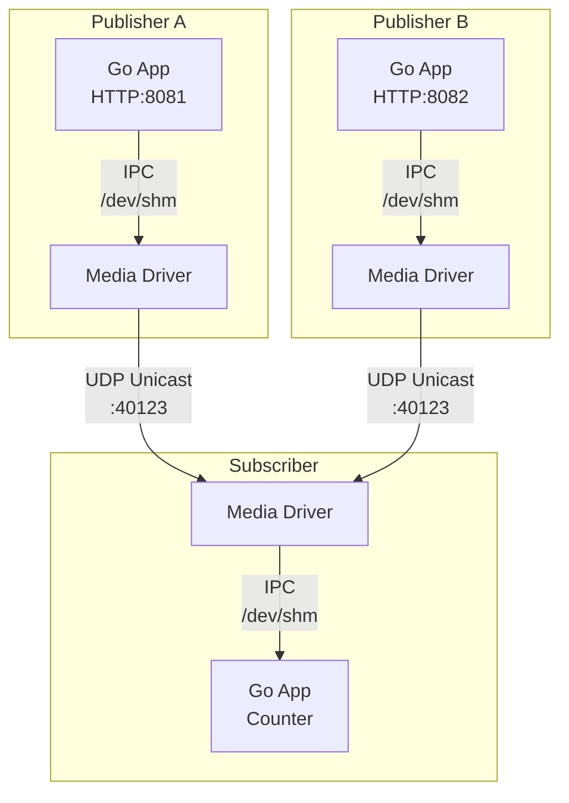

# aeron-sample

Aeronメッセージング基盤を使ったGoサンプルアプリケーション（分散構成版）。

## 概要

複数のPublisherからAeron（UDP Unicast）経由でメッセージを送信し、Subscriberで集約処理を行うサンプル。

## アーキテクチャ



## クイックスタート (Docker)

```bash
# 起動
make docker-up

# Publisher Aからメッセージ送信
curl -X POST http://localhost:8081/api/counter/increment \
  -H "Content-Type: application/json" \
  -d '{"amount": 5}'

# Publisher Bからメッセージ送信
curl -X POST http://localhost:8082/api/counter/increment \
  -H "Content-Type: application/json" \
  -d '{"amount": 10}'

# Subscriberのログを確認
docker logs subscriber-app

# 停止
make docker-down
```

## API

| コンテナ | Port | Method | Path | 説明 |
|---------|------|--------|------|------|
| publisher-a-app | 8081 | POST | `/api/counter/increment` | カウンター増加メッセージ送信 |
| publisher-a-app | 8081 | GET | `/health` | ヘルスチェック |
| publisher-b-app | 8082 | POST | `/api/counter/increment` | カウンター増加メッセージ送信 |
| publisher-b-app | 8082 | GET | `/health` | ヘルスチェック |

## プロジェクト構成

```
├── cmd/
│   ├── publisher/main.go    # Publisher エントリーポイント
│   └── subscriber/main.go   # Subscriber エントリーポイント
├── internal/
│   ├── aeron/               # Aeron Pub/Sub
│   ├── counter/             # カウンタービジネスロジック
│   ├── handler/             # HTTPハンドラ
│   ├── message/             # メッセージ型・コーデック
│   └── logging/             # ログ設定
├── scripts/                 # Aeron Driver起動スクリプト
├── Dockerfile               # Go アプリ用（マルチターゲット）
├── Dockerfile.aeron         # Aeron Media Driver用
└── docker-compose.yml       # 6サービス構成
```

## 技術スタック

- Go 1.23
- Aeron (`github.com/lirm/aeron-go`) - UDP経由メッセージング
- Aeron Media Driver (Java) - Dockerコンテナで起動

## Aeron通信方式

- **App ↔ Media Driver**: IPC（共有メモリ `/dev/shm`）
- **Media Driver ↔ Media Driver**: UDP Unicast（ポート40123）

## Dockerサービス構成

| サービス | 役割 |
|---------|------|
| publisher-a-driver | Publisher A用 Media Driver |
| publisher-a-app | Publisher A Go アプリ |
| publisher-b-driver | Publisher B用 Media Driver |
| publisher-b-app | Publisher B Go アプリ |
| subscriber-driver | Subscriber用 Media Driver |
| subscriber-app | Subscriber Go アプリ |

